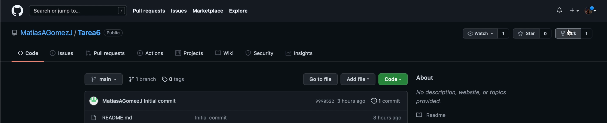
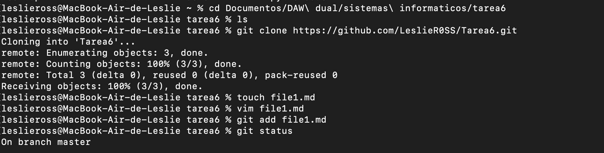
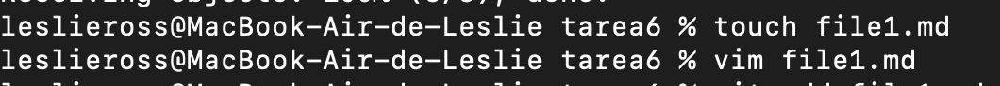
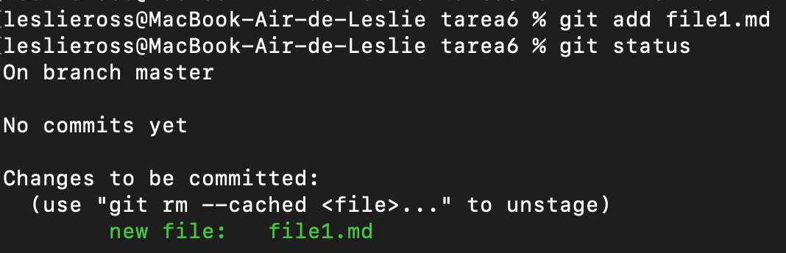
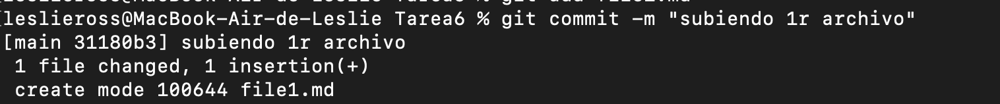
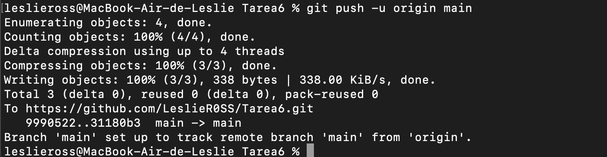

# **Tarea 6** - *Fork and pull. Trabajando con Ramas*

En esta tarea vamos a simular con mis compañeros que desarrollamos un mismo proyecto en común al igual que en la tarea 5, pero utilizando unos comando más: el **fork and pull**

## **1r paso: CRAEACIÓN DEL PROYECTO**

### Lo primero de todo, un miembro del equipo de desarrolladores (en nuestro caso el seleccionado es Matías), crea desde su Git un proyecto, llamado *Tare6*, 
El cual lo duplicamos en nuestro git, usando la función ***fork***. 

>Luego copiamos el enlace de ese repositorio compartido y usando el comando ***git clone*** lo clonamos en nuestro directorio local, en la ruta de nuestra elección.Y accedemos allí después. 
>>Recordamos que para cambiar de directorio desde la consola usamos el comando ***cd*** y para visualizar el contenido de la carpeta seleccionada, lo hacemos con ***ls***

 

## **2n paso: HACEMOS LAS MODIFICACIONES EN NUESTRA REPO DUPLICADA DE MATIAS**

### En mi caso, he escogido crear 5 archivos markdown (ej: ***touch file1.md***)y editando su contenido con ***vim file1.md***

## **4t paso: PREPARAMOS LOS ARCHIVOS PARA SU SUBIDA**
### Para poder subir los cambios a nuestro repositorio remoto y compartirlo con nuestros compañeros, previamente debemos pasar los archivos al estado *STAGED o "limbo"*, usamos : ***git add*** y luego hacemos ***git commmit -m "el mensaje"*** (esta información es necesaria y útil tanto para nuestro equipo y nosotros mismos ya que nos facilita y aporta más entendimiento)

>con ***git status*** podemos comprobar en efecto que esta el archivo en *STAGED* y en color verde.

 

## **5t paso: LO SUBIMOS FINALMENTE AL GIT**
### Por último, el paso que nos queda para acabar el proceso del gitflow, es hacer ***git push*** y ya nuestros cambios estarán en el repo remoto. 
>La primera vez que realizemo **git push** es recomendable utilizar mejor: ***git push -u origin main***

>Y así, sucesivamente hasta realizar las cinco modificaciones por nuestra parte, requerids para esta tarea. Por últio nuestro compañero Matías, realizará un ***git pull*** de todas las modificaciones del equipo para cobinarlas y que formen parte de un solo repositorio

---
# VIDEO:
Debido al tamaño del video que excede lo permitido para Git, lo subo en formato zip. 

---
# FIN TAREA 5

